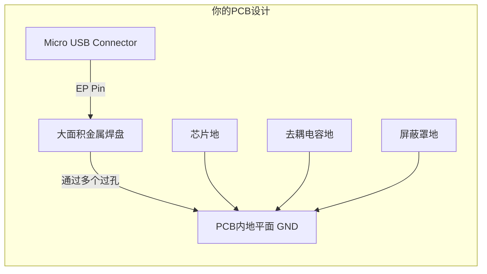

---
tags:
  - USB连接器
---
---
# USB连接器
目前市面上已经出现的USB连接器有很多种，主要分为以下几类
- USB-Micro连接器
- USB-TYPEC连接器

## Micro-USB

在Micro USB接口（以及许多其他连接器）中，**EP** 这个标识代表 **“EP”**。
### EP是什么？

**EP** 是连接器金属外壳本身的一个**机械固定引脚**。它的核心作用是：

1.  **机械固定**：EP引脚通常比旁边的信号引脚（D+， D-）和电源引脚（VBUS， GND）更长、更坚固。在焊接时，它会先接触焊盘，提供初步的固定，方便后续引脚的精确定位和焊接。
2.  **增强稳定性**：通过将其焊接在PCB板上的一个大焊盘上，它能将USB接口的金属外壳牢牢地“锁”在电路板上。这极大地增强了接口的**物理强度**，防止因多次插拔或意外拉扯导致接口松动、脱落，甚至将焊盘从PCB上撕掉。
3.  **电气屏蔽与接地（最重要且必须做的）**：USB接口的金属外壳是用来**屏蔽电磁干扰（EMI）** 的。将EP引脚与PCB上的**地平面（GND）** 大面积连接后，外壳就成为了一个有效的屏蔽层，可以：
    *   **抑制内部噪声向外辐射**，满足电磁兼容（EMC）标准。
    *   **阻挡外部噪声干扰内部敏感电路**。
    *   为静电（ESD）提供一条泄放路径到大地，保护后面的芯片（如RP2040）不被静电打坏。

---

### 🛠️ 在你的RP2040项目中的具体设计建议

对于你的Micro USB端口给RP2040供电的电路，正确处理EP引脚至关重要。

**正确的PCB设计方法：**

1.  **创建一个散热焊盘**：在PCB上，为EP引脚设计一个足够大的矩形焊盘。
2.  **连接至GND**：将此焊盘通过多个过孔，牢固地连接到你的PCB的**主地平面（GND）** 上。**务必确保整个地平面的完整性。**
3.  **添加开口**：在阻焊层（绿油层）上为这个焊盘开窗，确保焊接时焊锡能够良好地连接接口外壳和焊盘。

下图清晰地展示了如何在自己的PCB上正确地设计和连接这个EP引脚：

### 💎 总结与提醒

*   **EP是什么？** 它是USB接口的**外壳固定兼接地脚**。
*   **必须接哪里？** **必须可靠地连接到系统的GND（地）**。
*   **不接会怎样？**
    *   接口容易因插拔而损坏。
    *   电路容易受电磁干扰，工作不稳定。
    *   系统抗静电能力差，容易损坏芯片。

**请务必在你的PCB设计中，将EP引脚大面积接地。** 这是一个小细节，但却是区分布线是否专业、产品是否可靠的关键之一。
## USB-TYPEC
### Power-Only
对于USBTYPEC,又分为两大种类，一类为既可以传输电力，又可以传输数据的接口，还有一类为仅仅可以传输电力的接口。他们的使用方法有明显的区别
- 下方此图片即为一个仅仅可以传输电力的TYPEC接口
![[Pasted image 20251106222918.png]]
这种仅有 **VBUS**、**GND**、**CC1**、**CC2** 引脚的USB Type-C连接器，是一种精简版的"**仅供电型**"（Power-Only）连接器，主要用于充电和取电场景。
#### 连接器类型与特点
这种连接器主要有以下特点：
*   **核心功能**：专注于**电力传输**，支持USB Power Delivery (PD) 协议，默认提供5V电压，并通过PD协议协商更高电压（如9V, 12V, 15V, 20V）和更大电流（最高可达5A）。
*   **引脚精简**：移除了USB 2.0数据差分对（D+和D-）以及USB 3.0的高速数据线（TX/RX）。
*   **常用规格**：常见的6针（6Pin）Type-C连接器就采用这种配置。
*   **对称设计**：接口两端通常仍保留对称的VBUS和GND引脚，以支持**正反盲插**并承载较大电流。
#### 关键引脚功能详解
下表详细说明了各引脚的功能：

| 引脚名称     | 全功能Type-C对应引脚参考  | 功能说明                                                                       |
| :------- | :--------------- | :------------------------------------------------------------------------- |
| **VBUS** | A4, A9, B4, B9   | **电源正极**：电力传输的主通道。                                                         |
| **GND**  | A1, A12, B1, B12 | **电源地**：电流的回流路径。                                                           |
| **CC1**  | A5               | **配置通道1**：用于**连接检测**、**电缆方向侦测**、**角色识别**（是主机/供电方DFP，还是设备/受电方UFP）及**功率协商**。 |
| **CC2**  | B5               | **配置通道2**：功能同CC1。两个CC引脚共同确保无论线缆如何插入都能正确识别。                                 |

#### 电路设计要点
使用这种连接器时，**CC1和CC2引脚的正确配置至关重要**，这能确保设备被正确识别并协商供电。
*   **基本受电设备（UFP）设计**：
    如果您的设备（如小家电）仅作为受电方，且**没有内置PD协议芯片**，需要在**CC1和CC2引脚上各连接一个5.1kΩ (Rd) 的电阻下拉到地（GND）**。这告诉供电设备："我是一个合法的受电设备，需要供电"。

*   **专业设备与注意事项**：
    若需要作为**供电方（DFP）** 或支持**更复杂的PD协议**（如协商高于5V的电压），则需使用**专用的PD协议芯片**（如[[TUSB320]]系列）来处理CC通信。务必**不要在CC1和CC2引脚之间直接短接**，早期树莓派4曾因此导致与某些主动式线缆不兼容。

#### 应用场景与数据功能
这种连接器适用于众多**只需取电充电**、**无需USB数据传输**的日常生活用品，如玩具、电动工具、小风扇、台灯等。
需要注意的是，这种精简接口**不支持USB数据传输**。如果项目需要数据传输，您需要选择包含D+和D-引脚的USB 2.0 Type-C连接器（通常为16Pin或12Pin封装），或功能更全面的Type-C连接器。

### FULL-FUNC
全功能USB Type-C连接器是现代电子设备接口技术的集大成者，它在一个小巧的、可正反插的接口上实现了**高速数据**、**强大电力**和**丰富视频**信号的统一传输。
#### 物理与引脚定义：为什么有24个引脚？

全功能Type-C（24Pin）的核心在于其**中心对称的引脚布局**。这24个引脚被排列在接口的上下两侧（A面和B面），这正是实现正反插拔的物理基础。

为了更直观地理解这24个引脚的布局和功能，请参考下面的图表，它清晰地展示了引脚的位置分布及其主要用途：

```mermaid
flowchart TD
subgraph TypeC[USB Type-C 24针连接器]
    direction TB
    subgraph A面[A面引脚（上排）]
        A1[GND] --- A2[TX1+] --- A3[TX1-] --- A4[VBUS] --- A5[CC1] --- A6[D+] --- A7[D-] --- A8[SBU1] --- A9[VBUS] --- A10[RX2-] --- A11[RX2+] --- A12[GND]
    end
    
    subgraph B面[B面引脚（下排）]
        B12[GND] --- B11[RX1+] --- B10[RX1-] --- B9[VBUS] --- B8[SBU2] --- B7[D-] --- B6[D+] --- B5[CC2] --- B4[VBUS] --- B3[TX2-] --- B2[TX2+] --- B1[GND]
    end
end

```

这些引脚可以划分为以下几个功能组：

| 功能群组            | 引脚名称                                     | 说明                                               |
| :-------------- | :--------------------------------------- | :----------------------------------------------- |
| **电源 & 接地**     | **VBUS**                                 | 标准电源总线，默认5V，支持USB PD协议后最高可达48V。                  |
|                 | **GND**                                  | 电源回流路径，提供稳定的接地。                                  |
|                 | **CC1, CC2**                             | **配置通道**，Type-C的“大脑”，负责连接检测、方向识别、模式配置和功率协商。      |
| **USB 2.0数据**   | **D+, D-**                               | 标准的USB 2.0差分数据对，用于低速数据传输或向后兼容。                   |
| **USB 3.2高速数据** | **TX1+/-, RX2+/-** **TX2+/-, RX1+/-** | 两组超高速差分对，用于USB 3.2 Gen1/Gen2（最高20Gbps）的数据收发。     |
| **替代模式**        | **SBU1, SBU2**                           | **边带使用通道**，在Alternate Mode下用于传输额外的信号，如DP模式的音频通道。 |

#### 核心特性详解

##### 1. 可逆插拔与电缆方向侦测
*   **实现原理**：通过上下两排对称的引脚实现。插入时，线缆和端口内的逻辑会通过**CC引脚**检测插入方向，并自动切换到正确的数据线对。
*   **用户体验**：用户无需关心正反面，直接插入即可。

##### 2. 强大的电源管理
*   **默认功率**：5V/0.5A 或 5V/3A（通过CC引脚下拉电阻识别）。
*   **USB Power Delivery**：通过CC引脚上的双向数字通信，设备可以动态协商更高的电压和电流，最高可达 **48V 5A (240W)**。这使得它可以为笔记本电脑、显示器甚至一些小型工作站供电。

##### 3. 高速数据传输
*   **USB 2.0模式**：使用D+/D-，速度最高480Mbps。
*   **USB 3.2 / USB4模式**：使用TX/RX高速差分对。速度从5Gbps ([[USB 3.2 Gen1]]) 到 80Gbps ([[USB4 v2.0]]) 不等，满足了外接高速SSD、高分辨率摄像头等设备的带宽需求。

##### 4. 替代模式 - 真正的“全功能”精髓
这是Type-C最革命性的特性之一。通过Alternate Mode，Type-C接口可以传输**非USB信号**。
*   [[**DisplayPort Alt Mode**]]：最为常见，可以直接输出DisplayPort视频信号，支持高分辨率、高刷新率的显示器。
*   [[**Thunderbolt™ 3/4**]]：由Intel主导，融合了PCIe数据传输和DisplayPort视频输出，提供极高的速度和极强的扩展能力。
*   **HDMI Alt Mode**：可以直接输出HDMI信号。
*   **其他**：如VirtualLink（用于VR设备）等。

在替代模式下，原本用于USB 3.2的高速TX/RX差分对会被重新分配用于传输视频信号。

#### 电路设计要点

设计一个全功能Type-C接口相对复杂，需要综合考虑：

1.  **CC逻辑与电阻配置**：
    *   **仅受电设备**：需要在**CC1和CC2上各接一个5.1kΩ下拉电阻到地**。
    *   **双角色设备**：需要专用的**PD协议芯片**（如英飞凌的[[CYPD]]系列、安森美的[[FUSB302]]等）来智能管理CC通信和功率角色。

2.  **高速信号完整性**：
    *   USB 3.2和Alt Mode的高速差分对（TX/RX）是**射频信号**，必须遵循严格的PCB设计规则：
        *   **阻抗控制**：通常要求[[差分阻抗]]控制在90Ω ±10%。
        *   **等长布线**：差分对内的两条线长度要尽可能匹配。
        *   **尽量减少过孔**，避免锐角走线。

3.  **电源完整性**：
    *   由于支持大功率，VBUS和GND的走线宽度必须足够宽，或使用电源平面，以承载大电流而不产生过多压降或发热。
#### 总结

全功能USB Type-C连接器是一个高度集成、功能强大的接口平台。它远不止是一个USB口，而是成为了一个**通用的物理连接标准**，统一了数据、电力和视频传输。在设计使用时，需要根据您的具体需求（是否需要高速数据？是否需要视频输出？供电角色是什么？）来选择和实现相应的功能模块，其中**CC引脚的正确配置和高速信号的完整性**是成功的关键。

## 16PIN

![[Pasted image 20251231220916.png]]

16个引脚，其中2个引脚用于固定，2个引脚接入外壳，总计剩余12个引脚，分配如下：

| PIN | NAME | DIS                            | PIN | NAME | DIS                            |
| :-: | :--: | :----------------------------- | :-: | :--: | :----------------------------- |
| A1  | GND  | 地线引脚（接地）                       | B12 | GND  | 地线引脚（接地）                       |
| A4  | VBUS | 电源线（用于供电，5V、9V 或更高电压）          | B9  | VBUS | 电源线（用于供电，5V、9V 或更高电压）          |
| A5  | CC1  | 配置通道 1（用于检测连接类型，控制电源协商等）       | B8  | SBU2 | 备用信号 2（通常用于音频、视频传输等）           |
| A6  | DP1  | 数据传输正极 1（差分信号线，USB 2.0/3.0 数据） | B7  | DN2  | 数据传输负极 2（差分信号线，USB 2.0/3.0 数据） |
| A7  | DN1  | 数据传输负极 1（差分信号线，USB 2.0/3.0 数据） | B6  | DP2  | 数据传输正极 2（差分信号线，USB 2.0/3.0 数据） |
| A8  | SBU1 | 备用信号 1（通常用于音频、视频传输等）           | B5  | CC2  | 配置通道 2（用于检测连接类型，控制电源协商等）       |
| A9  | VBUS | 电源线（用于供电，5V、9V 或更高电压）          | B4  | VBUS | 电源线（用于供电，5V、9V 或更高电压）          |
| A12 | GND  | 地线引脚（接地）                       | B1  | GND  | 地线引脚（接地）                       |

### **引脚功能分析**

1. **电源引脚（VBUS 和 GND）**：
    
    - **VBUS**（A9, A4, B9, B4）是电源引脚，用于为设备提供电源，支持不同电压（5V、9V、12V 等），通过 **USB Power Delivery (PD)** 协议可以进行电压协商。
        
    - **GND**（A1, A12, B1, B12）是地线，引脚连接设备的电源回路。
        
2. **配置通道（CC1 和 CC2）**：
    
    - **CC1（A5）和 CC2（B5）** 用于配置通道，它们在 USB Type-C 中用于识别连接方向和控制电源协商。USB Type-C 是可逆的，通过这两个引脚的检测来确定插头的方向，并协商电压和电流。
        
3. **数据传输（DP1, DN1, DP2, DN2）**：
    
    - **DP1, DN1（A6, A7）** 和 **DP2, DN2（B6, B7）** 用于差分数据传输。**DP** 是数据传输的正极，**DN** 是数据传输的负极，这些引脚用于 USB 数据传输（通常是 USB 2.0 或 3.0 的数据传输）。
        
4. **备用信号（SBU1 和 SBU2）**：
    
    - **SBU1（A8）和 SBU2（B8）** 是备用信号引脚，通常用于音频或视频传输，或者在一些特殊协议下作为备用数据线。
        

### **如何连接这些引脚：**

- **电源连接**：
    
    - **VBUS（A4, A9, B4, B9）** 应该连接到你设备的电源管理电路，通常为 5V 或 9V。你可以通过 **USB PD 控制器** 实现电压协商。
        
    - **GND（A1, A12, B1, B12）** 连接到设备的负极电源回路。
        
- **配置通道（CC1 和 CC2）**：
    
    - **CC1 和 CC2** 用于 **连接方向检测** 和 **电源协商**。需要连接到电源管理模块或 USB PD 控制器。
        
    - 这些引脚的作用是通过检测电阻来判断插头的方向并与电源适配器进行电压协商。
        
- **数据传输**：
    
    - **DP1, DN1（A6, A7）** 和 **DP2, DN2（B6, B7）** 是用于 USB 数据传输的引脚，你需要连接到设备的 **USB 控制器** 或 **嵌入式处理器** 上。这些引脚将用于数据的双向传输。
        
    - 如果你需要高速数据传输（如 USB 3.x），这些引脚会承担差分信号传输任务。
        
- **备用信号（SBU1 和 SBU2）**：
    
    - **SBU1 和 SBU2** 用于 **音频** 或 **视频传输**，例如支持 **DisplayPort Alternate Mode** 或 **音频传输**。
        
    - 如果你不需要这些功能，可以将其忽略或留空，但如果需要音视频传输，建议连接到相关信号模块。
        

### **电源管理与数据传输的建议设计：**

1. **电源管理**：
    
    - 使用 **USB PD 控制器** 来处理 **VBUS** 的电压协商（例如 **Texas Instruments** 的 USB PD 控制器）。根据需要为设备选择适当的电压（5V 或更高）。
        
2. **数据传输设计**：
    
    - 数据引脚 **DP1, DN1, DP2, DN2** 通常连接到 **USB 控制器** 或 **数据传输芯片**（如 **FTDI、Cypress 或 Microchip** 提供的 USB 数据芯片）。
        
3. **备用信号使用**：
    
    - 如果需要支持 **音视频传输** 或其他协议，可以将 **SBU1 和 SBU2** 引脚连接到适当的 **音频或视频解码/编码器**，例如，连接到 **DisplayPort** 或 **音频接口**。

[使用USBTYPEC接口获得5V3A的简单方法](https://forum.digikey.com/t/simple-way-to-use-usb-type-c-to-get-5v-at-up-to-3a-15w/7016)
**核心意思：**  
通过在你的设备（称为“向上朝向端口”，即UFP，也就是普通用电设备）的USB-C接口上，仅用两个电阻进行简单配置，就可以从兼容的USB-C电源（如充电器或电脑）获取最高3A电流的5V电压。

**关键点详解：**

1. **方法本质**：这是一种**模拟信号**配置，不涉及复杂的数字通信协议。它利用了USB-C标准中为基本供电定义的一套“电阻身份识别”机制。
    
2. **具体操作**：
    
    - 在你的设备的USB-C连接器上，找到两个 **CC** （配置通道）引脚。
        
    - 在这两个CC引脚上，各自连接一个**5.1kΩ、精度1%** 的电阻到**地**（GND）。
        
3. **实现效果**：当你的设备通过这样的USB-C线缆连接到电源（称为“向下朝向端口”，即DFP，如充电器）时，电源会检测到这两个电阻，从而识别出你的设备是一个符合标准的“电流接收设备”，并会按照标准为其提供**最高5V/3A**的电力输出（前提是电源本身具备此供电能力）。
    
4. **范围界定**：
    
    - **不包括**：文中特意强调了这种方法**不涉及**更高级的、需要数字通信的**USB PD（电力传输）协议**。USB PD协议可以实现更高的电压（如9V, 12V, 20V）和功率，但需要专门的芯片进行协商。
        
    - **也不包括**：文中也未深入讨论电源端（DFP）如何通过电阻来宣告自身供电能力的那部分标准。
        
5. **实例参考**：作者举了Sparkfun（一个开源硬件厂商）的一款USB-C转接板作为例子，该板子就是通过集成这两个必要的电阻来实现5V/3A取电功能的。
    

**通俗总结：**  
“你只需要在你自己设备的USB-C接口的CC脚上，焊两个5.1k的精确定电阻到地，然后接上合格的USB-C电源，理论上就能让它给你供5伏最高3安培的电，简单粗暴，可以直接开干。”

**重要提示**：这是一种符合USB-C基础规范的标准做法，但实际设计和产品化时，仍需严格遵循相关安全与电气规范。

### 第一部分：风险警告

你之前提到的“两个电阻搞定”的方法**存在一定风险**。前提是你的USB-C线缆和电源**必须确实支持15W（5V/3A）输出**。否则，如果你连接的电源（比如一个老旧的平板、笔记本USB口、或者用**USB-A转USB-C的旧线缆**）能力不足，却试图从中抽取3A电流，就可能导致：

1. **电源保护性热关机**：电源内部的半导体器件过热，触发保护而反复重启。
    
2. **更严重的损坏**：器件持续过热，最终导致“烧毁冒烟”（“burney burney”）。
    

### 第二部分：规范机制的简述

为了避免上述问题，并让设备之间能“安全对话”，标准的USB-C规范为**电源端（DFP）和设备端（UFP）都定义了电阻配置规则**：

- **电源端（DFP）的责任**：它需要通过在其CC引脚上连接**特定阻值的上拉电阻**来**广播**自己的能力。例如，不同的阻值对应着不同的默认供电能力（如500mA, 1.5A, 3A）。
    
- **设备端（UFP）的责任**：你之前提到的“两个5.1k下拉电阻”是设备端**必须**做的，用于**宣告自己是一个合法的USB-C设备**。
    
- **协商过程**：当双方都连接好并遵循规范时，会发生以下“对话”：
    
    1. 设备端（UFP）的5.1k下拉电阻让电源端（DFP）检测到有设备接入。
        
    2. 电源端（DFP）测量CC引脚上的电压，这个电压值由它自己的上拉电阻和设备的5.1k下拉电阻分压决定。
        
    3. 电源端通过测量到的这个**电压值**，来判断设备连接到了哪个CC引脚（以确定正反插），并**识别出设备端下拉电阻的值是标准的5.1k**，从而确认这是一个合规设备。
        
    4. **关键一步**：同时，**设备端（UFP）也会测量CC引脚上的电压**。这个电压值是由电源端的上拉电阻和自身的下拉电阻分压决定的。设备通过测量这个电压，就能反向推断出**电源端广播的供电能力是多少**（例如，对应3A能力的电源，其上拉电阻值是特定的，产生的电压也是特定的）。
        
    5. 这样一来，设备就知道了电源的能力，从而可以决定是否按最大3A电流来取电，还是为了安全而限制到更低的电流。
        

### 总结与对比

|场景|工作原理|风险|
|---|---|---|
|**你之前描述的方法**|设备端（UFP）**单方面**用5.1k电阻宣告“我是合规设备”，并**假定**电源一定能提供3A。|如果电源能力不足或不符合标准（如旧式USB-A电源），可能发生过载、过热或损坏。|
|**文中补充的规范机制**|**双向通信**。电源端用上拉电阻**广播能力**，设备端用下拉电阻**宣告身份**，同时**检测电源能力**并自适应。|安全。设备只在电源能力范围内取电，避免了过载风险。|

**简单来说：** 作者最后承认，一个真正健壮的设计不能只考虑设备端自己。为了避免“把电源搞冒烟”，理想的USB-C设备（UFP）不仅应该配置那两个5.1k下拉电阻，**还应该具备监测CC引脚电压的功能**，以便判断所连接电源的实际供电能力，并据此调整自身的电流消耗，实现安全取电。这才是完整的、符合USB-C规范的供电协商流程。

对于设计 **DAPLink** 这种基于 **USB 2.0** 协议的设备，你的引脚连接需要遵循以下原则：

### 1. DP1/DN1 与 DP2/DN2 引脚（数据传输）

虽然你看到有两组 DP/DN 引脚，但在 **USB 2.0 母口** 内部或 PCB 设计上，它们实际上是共用的。

- **连接方式**：将 **DP1 (A6) 与 DP2 (B6) 短接** 连在一起，引出一根信号线接到 MCU 的 `USB_DP`（通常是 STM32 的 PA12）。
    
- **连接方式**：将 **DN1 (A7) 与 DN2 (B7) 短接** 连在一起，引出一根信号线接到 MCU 的 `USB_DM`（通常是 STM32 的 PA11）。
    
- **注意**：短接的位置应尽可能靠近母口焊盘。这两根线必须走**差分对**（等长、平行、紧挨着），以保证 480Mbps（高速）或 12Mbps（全速）的传输稳定性。
    

### 2. SBU1 / SBU2 引脚（辅助信号）

- **处理方案**：**直接悬空（NC，No Connect）**。
    
- **原因**：SBU 引脚在 USB-C 标准中用于“备用模式（Alt Mode）”，例如传输 DisplayPort 视频信号。对于 DAPLink 这种纯 USB 通信设备，完全用不到这两个引脚。
    

### 3. CC1 / CC2 引脚（配置通道）

- **必须处理**：正如之前讨论的，这两个引脚**千万不能短接**。
    
- **连接方式**：
    
    - **CC1 (A5)** $\rightarrow$ $5.1k\Omega$ 电阻 $\rightarrow$ **GND**
        
    - **CC2 (B5)** $\rightarrow$ $5.1k\Omega$ 电阻 $\rightarrow$ **GND**
        

---

### 修改后的引脚连接清单

|**引脚名称**|**连接建议**|**目的**|
|---|---|---|
|**VBUS (A4, A9, B4, B9)**|**合并** 后接滤波电路 (10μF + 磁珠 + 100nF)|供电输入|
|**GND (A1, A12, B1, B12)**|**合并** 后接 PCB 全局地|电源回路|
|**DP1 / DP2**|**短接** 后接 MCU 的 `USB_DP`|USB 数据线（正）|
|**DN1 / DN2**|**短接** 后接 MCU 的 `USB_DM`|USB 数据线（负）|
|**CC1**|接 **5.1kΩ** 下拉电阻到 GND|触发电脑供电|
|**CC2**|接 **5.1kΩ** 下拉电阻到 GND|触发电脑供电（反插识别）|
|**SBU1 / SBU2**|**悬空** (不接)|无需使用|

---

### PCB 布线关键细节：

1. 差分阻抗控制：
    
    如果你使用的是普通的双层板（1.6mm 厚度），USB D+ 和 D- 的线宽建议设为 10-12 mil，线间距设为 6-8 mil。这能大致接近 $90\Omega$ 的差分阻抗要求。
    
2. 避免过孔：
    
    DP/DN 信号线尽量在顶层走到底，不要频繁打过孔换层，否则会引起信号反射。
    
3. 磁珠的位置：
    
    磁珠应该串联在 VBUS 总线上，即：母口 VBUS 焊盘 $\rightarrow$ 10μF 电容 $\rightarrow$ 磁珠 $\rightarrow$ 后续 5V 总线。
    

**你现在使用的 MCU 是 STM32F103 还是其他型号？** 不同芯片的 USB 引脚名称可能略有不同（例如有的叫 D+ / D-，有的叫 DP / DM）。

跳出你目前的 DAPLink 项目，从底层硬件设计的视角来看，**USB_NOE**（USB Negative Output Enable）是一个非常“硬核”的信号。在大多数消费电子设计中它是隐形的，但在**高性能、高可靠性或工业隔离**领域，它是不可或缺的。

### 1. 什么是 USB_NOE？

简单来说，它是单片机内部 USB 控制器给**外部硬件**下达的“开火指令”。

USB 2.0 是一种**半双工**通讯：D+ 和 D- 既要负责接收数据，也要负责发送数据。

- **接收时**：单片机内部的发送驱动器必须断开（高阻态），把线路让给外部信号。
    
- **发送时**：单片机必须激活发送驱动器。
    

**USB_NOE 引脚**就是一个硬件同步信号：当单片机准备好要向总线输出数据时，它会自动拉低（Negative，所以是低电平有效）这个引脚，告诉外部：“注意，我要开始输出了！”

---

### 2. 你应该在什么时候使用它？

虽然 STM32 内部集成了收发器（PHY），但在以下三种特定场景中，你必须启用并连接 USB_NOE：

#### A. 场景一：使用“全隔离”USB 方案（最常见）

如果你正在设计一个用于高压测试、医疗设备或工业电机的调试器，你不能让电脑的 USB 直接连到现场。

- **问题**：普通的数字隔离器（如 ADuM1201）只能单向传输，而 USB 是双向的。
    
- **解决**：你需要专门的 USB 隔离芯片（如 **ADuM3160** 或使用分立的逻辑网关）。
    
- **NOE 的作用**：隔离芯片需要通过 USB_NOE 信号来判断当前的电流方向——是该把“电脑端”的信号传给“设备端”，还是反过来。没有这个信号，隔离器就不知道何时该切换收发方向。
    

#### B. 场景二：外接高性能 USB 物理层芯片 (External PHY)

有些特殊的芯片或为了通过极其严格的电磁兼容（EMC）测试，开发者会选择关闭单片机内部的 PHY，转而使用外部的专业 USB 收发器。

- **NOE 的作用**：它连接到外部收发器的 `OE`（Output Enable）引脚。只有当 NOE 有效时，外部收发器才会驱动 D+/D- 线路。这能避免两个驱动器同时说话导致的“总线冲突”。
    

#### C. 场景三：长距离驱动或复杂的总线切换

如果你的 USB 信号需要经过很长的排线，或者需要通过模拟开关切换到不同的接口。

- **NOE 的作用**：你可以用它来控制模拟开关的使能，确保只有在数据输出时才打通特定路径，从而减少空闲时的噪声干扰。
    

---

### 3. 如何在 STM32 中启用它？

在软件层面，USB_NOE 通常与 **PA13** 引脚复用。

1. **引脚配置**：在 CubeMX 或代码中，将 PA13 的复用功能（AF）配置为 `USB_NOE`。
    
2. **寄存器设置**：在 USB 控制器寄存器（如 `USB_CNTR`）中，通常有一个 `LPUART` 或相关的模式位，用于启用这个输出使能信号。
    

---

### 4. 总结：用还是不用？

- **不用（95% 的情况）**：如果你是直连 Type-C 接口，且 D+/D- 线路很短（<15cm），内部 PHY 足以应付。此时 PA13 应该留给 **SWDIO** 用来调试。
    
- **必须用**：当你需要在 USB 链路上加入 **光电隔离**、**磁隔离** 或者 **外部收发器** 时。
    

**如果有一天你打算做一个“工业增强版隔离 DAPLink”，这个引脚就是你解决数据流向问题的“钥匙”。**

既然聊到了隔离，你是否想了解一下，如果不用这个 NOE 引脚，市面上那些“即插即用”的 USB 隔离模块（比如几十块钱一个的）是怎么实现自动方向切换的？