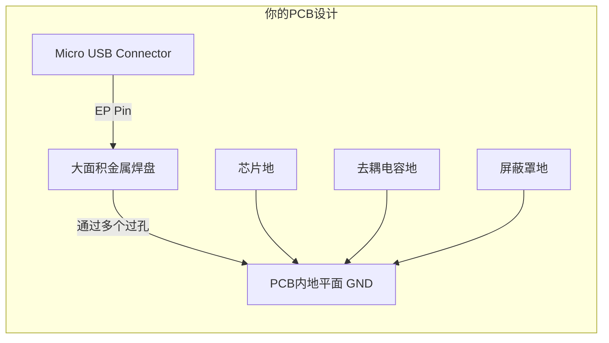

---
tags:
  - USB连接器
---
---
# USB连接器
目前市面上已经出现的USB连接器有很多种，主要分为以下几类
- USB-Micro连接器
- USB-TYPEC连接器

## Micro-USB

在Micro USB接口（以及许多其他连接器）中，**EP** 这个标识代表 **“EP”**。
### EP是什么？

**EP** 是连接器金属外壳本身的一个**机械固定引脚**。它的核心作用是：

1.  **机械固定**：EP引脚通常比旁边的信号引脚（D+， D-）和电源引脚（VBUS， GND）更长、更坚固。在焊接时，它会先接触焊盘，提供初步的固定，方便后续引脚的精确定位和焊接。
2.  **增强稳定性**：通过将其焊接在PCB板上的一个大焊盘上，它能将USB接口的金属外壳牢牢地“锁”在电路板上。这极大地增强了接口的**物理强度**，防止因多次插拔或意外拉扯导致接口松动、脱落，甚至将焊盘从PCB上撕掉。
3.  **电气屏蔽与接地（最重要且必须做的）**：USB接口的金属外壳是用来**屏蔽电磁干扰（EMI）** 的。将EP引脚与PCB上的**地平面（GND）** 大面积连接后，外壳就成为了一个有效的屏蔽层，可以：
    *   **抑制内部噪声向外辐射**，满足电磁兼容（EMC）标准。
    *   **阻挡外部噪声干扰内部敏感电路**。
    *   为静电（ESD）提供一条泄放路径到大地，保护后面的芯片（如RP2040）不被静电打坏。

---

### 🛠️ 在你的RP2040项目中的具体设计建议

对于你的Micro USB端口给RP2040供电的电路，正确处理EP引脚至关重要。

**正确的PCB设计方法：**

1.  **创建一个散热焊盘**：在PCB上，为EP引脚设计一个足够大的矩形焊盘。
2.  **连接至GND**：将此焊盘通过多个过孔，牢固地连接到你的PCB的**主地平面（GND）** 上。**务必确保整个地平面的完整性。**
3.  **添加开口**：在阻焊层（绿油层）上为这个焊盘开窗，确保焊接时焊锡能够良好地连接接口外壳和焊盘。

下图清晰地展示了如何在自己的PCB上正确地设计和连接这个EP引脚：

### 💎 总结与提醒

*   **EP是什么？** 它是USB接口的**外壳固定兼接地脚**。
*   **必须接哪里？** **必须可靠地连接到系统的GND（地）**。
*   **不接会怎样？**
    *   接口容易因插拔而损坏。
    *   电路容易受电磁干扰，工作不稳定。
    *   系统抗静电能力差，容易损坏芯片。

**请务必在你的PCB设计中，将EP引脚大面积接地。** 这是一个小细节，但却是区分布线是否专业、产品是否可靠的关键之一。
## USB-TYPEC
### Power-Only
对于USBTYPEC,又分为两大种类，一类为既可以传输电力，又可以传输数据的接口，还有一类为仅仅可以传输电力的接口。他们的使用方法有明显的区别
- 下方此图片即为一个仅仅可以传输电力的TYPEC接口
![[Pasted image 20251106222918.png]]
这种仅有 **VBUS**、**GND**、**CC1**、**CC2** 引脚的USB Type-C连接器，是一种精简版的"**仅供电型**"（Power-Only）连接器，主要用于充电和取电场景。
#### 连接器类型与特点
这种连接器主要有以下特点：
*   **核心功能**：专注于**电力传输**，支持USB Power Delivery (PD) 协议，默认提供5V电压，并通过PD协议协商更高电压（如9V, 12V, 15V, 20V）和更大电流（最高可达5A）。
*   **引脚精简**：移除了USB 2.0数据差分对（D+和D-）以及USB 3.0的高速数据线（TX/RX）。
*   **常用规格**：常见的6针（6Pin）Type-C连接器就采用这种配置。
*   **对称设计**：接口两端通常仍保留对称的VBUS和GND引脚，以支持**正反盲插**并承载较大电流。
#### 关键引脚功能详解
下表详细说明了各引脚的功能：

| 引脚名称     | 全功能Type-C对应引脚参考  | 功能说明                                                                       |
| :------- | :--------------- | :------------------------------------------------------------------------- |
| **VBUS** | A4, A9, B4, B9   | **电源正极**：电力传输的主通道。                                                         |
| **GND**  | A1, A12, B1, B12 | **电源地**：电流的回流路径。                                                           |
| **CC1**  | A5               | **配置通道1**：用于**连接检测**、**电缆方向侦测**、**角色识别**（是主机/供电方DFP，还是设备/受电方UFP）及**功率协商**。 |
| **CC2**  | B5               | **配置通道2**：功能同CC1。两个CC引脚共同确保无论线缆如何插入都能正确识别。                                 |

#### 电路设计要点
使用这种连接器时，**CC1和CC2引脚的正确配置至关重要**，这能确保设备被正确识别并协商供电。
*   **基本受电设备（UFP）设计**：
    如果您的设备（如小家电）仅作为受电方，且**没有内置PD协议芯片**，需要在**CC1和CC2引脚上各连接一个5.1kΩ (Rd) 的电阻下拉到地（GND）**。这告诉供电设备："我是一个合法的受电设备，需要供电"。

*   **专业设备与注意事项**：
    若需要作为**供电方（DFP）** 或支持**更复杂的PD协议**（如协商高于5V的电压），则需使用**专用的PD协议芯片**（如[[TUSB320]]系列）来处理CC通信。务必**不要在CC1和CC2引脚之间直接短接**，早期树莓派4曾因此导致与某些主动式线缆不兼容。

#### 应用场景与数据功能
这种连接器适用于众多**只需取电充电**、**无需USB数据传输**的日常生活用品，如玩具、电动工具、小风扇、台灯等。
需要注意的是，这种精简接口**不支持USB数据传输**。如果项目需要数据传输，您需要选择包含D+和D-引脚的USB 2.0 Type-C连接器（通常为16Pin或12Pin封装），或功能更全面的Type-C连接器。

### FULL-FUNC
全功能USB Type-C连接器是现代电子设备接口技术的集大成者，它在一个小巧的、可正反插的接口上实现了**高速数据**、**强大电力**和**丰富视频**信号的统一传输。
#### 物理与引脚定义：为什么有24个引脚？

全功能Type-C（24Pin）的核心在于其**中心对称的引脚布局**。这24个引脚被排列在接口的上下两侧（A面和B面），这正是实现正反插拔的物理基础。

为了更直观地理解这24个引脚的布局和功能，请参考下面的图表，它清晰地展示了引脚的位置分布及其主要用途：

```mermaid
flowchart TD
subgraph TypeC[USB Type-C 24针连接器]
    direction TB
    subgraph A面[A面引脚（上排）]
        A1[GND] --- A2[TX1+] --- A3[TX1-] --- A4[VBUS] --- A5[CC1] --- A6[D+] --- A7[D-] --- A8[SBU1] --- A9[VBUS] --- A10[RX2-] --- A11[RX2+] --- A12[GND]
    end
    
    subgraph B面[B面引脚（下排）]
        B12[GND] --- B11[RX1+] --- B10[RX1-] --- B9[VBUS] --- B8[SBU2] --- B7[D-] --- B6[D+] --- B5[CC2] --- B4[VBUS] --- B3[TX2-] --- B2[TX2+] --- B1[GND]
    end
end

```

这些引脚可以划分为以下几个功能组：

| 功能群组            | 引脚名称                                     | 说明                                               |
| :-------------- | :--------------------------------------- | :----------------------------------------------- |
| **电源 & 接地**     | **VBUS**                                 | 标准电源总线，默认5V，支持USB PD协议后最高可达48V。                  |
|                 | **GND**                                  | 电源回流路径，提供稳定的接地。                                  |
|                 | **CC1, CC2**                             | **配置通道**，Type-C的“大脑”，负责连接检测、方向识别、模式配置和功率协商。      |
| **USB 2.0数据**   | **D+, D-**                               | 标准的USB 2.0差分数据对，用于低速数据传输或向后兼容。                   |
| **USB 3.2高速数据** | **TX1+/-, RX2+/-** **TX2+/-, RX1+/-** | 两组超高速差分对，用于USB 3.2 Gen1/Gen2（最高20Gbps）的数据收发。     |
| **替代模式**        | **SBU1, SBU2**                           | **边带使用通道**，在Alternate Mode下用于传输额外的信号，如DP模式的音频通道。 |

#### 核心特性详解

##### 1. 可逆插拔与电缆方向侦测
*   **实现原理**：通过上下两排对称的引脚实现。插入时，线缆和端口内的逻辑会通过**CC引脚**检测插入方向，并自动切换到正确的数据线对。
*   **用户体验**：用户无需关心正反面，直接插入即可。

##### 2. 强大的电源管理
*   **默认功率**：5V/0.5A 或 5V/3A（通过CC引脚下拉电阻识别）。
*   **USB Power Delivery**：通过CC引脚上的双向数字通信，设备可以动态协商更高的电压和电流，最高可达 **48V 5A (240W)**。这使得它可以为笔记本电脑、显示器甚至一些小型工作站供电。

##### 3. 高速数据传输
*   **USB 2.0模式**：使用D+/D-，速度最高480Mbps。
*   **USB 3.2 / USB4模式**：使用TX/RX高速差分对。速度从5Gbps ([[USB 3.2 Gen1]]) 到 80Gbps ([[USB4 v2.0]]) 不等，满足了外接高速SSD、高分辨率摄像头等设备的带宽需求。

##### 4. 替代模式 - 真正的“全功能”精髓
这是Type-C最革命性的特性之一。通过Alternate Mode，Type-C接口可以传输**非USB信号**。
*   [[**DisplayPort Alt Mode**]]：最为常见，可以直接输出DisplayPort视频信号，支持高分辨率、高刷新率的显示器。
*   [[**Thunderbolt™ 3/4**]]：由Intel主导，融合了PCIe数据传输和DisplayPort视频输出，提供极高的速度和极强的扩展能力。
*   **HDMI Alt Mode**：可以直接输出HDMI信号。
*   **其他**：如VirtualLink（用于VR设备）等。

在替代模式下，原本用于USB 3.2的高速TX/RX差分对会被重新分配用于传输视频信号。

#### 电路设计要点

设计一个全功能Type-C接口相对复杂，需要综合考虑：

1.  **CC逻辑与电阻配置**：
    *   **仅受电设备**：需要在**CC1和CC2上各接一个5.1kΩ下拉电阻到地**。
    *   **双角色设备**：需要专用的**PD协议芯片**（如英飞凌的[[CYPD]]系列、安森美的[[FUSB302]]等）来智能管理CC通信和功率角色。

2.  **高速信号完整性**：
    *   USB 3.2和Alt Mode的高速差分对（TX/RX）是**射频信号**，必须遵循严格的PCB设计规则：
        *   **阻抗控制**：通常要求[[差分阻抗]]控制在90Ω ±10%。
        *   **等长布线**：差分对内的两条线长度要尽可能匹配。
        *   **尽量减少过孔**，避免锐角走线。

3.  **电源完整性**：
    *   由于支持大功率，VBUS和GND的走线宽度必须足够宽，或使用电源平面，以承载大电流而不产生过多压降或发热。
#### 总结

全功能USB Type-C连接器是一个高度集成、功能强大的接口平台。它远不止是一个USB口，而是成为了一个**通用的物理连接标准**，统一了数据、电力和视频传输。在设计使用时，需要根据您的具体需求（是否需要高速数据？是否需要视频输出？供电角色是什么？）来选择和实现相应的功能模块，其中**CC引脚的正确配置和高速信号的完整性**是成功的关键。